# Registering & Scanning ADLS Gen2 Account

## Introduction

In this module, you'll walk through how to register and scan ADLS Gen2 account. You'll register a ADLS Gen2 account and configure scanning. 

## Objectives

* Grant the Microsoft Purview Managed Identity Access
* Upload Data to Azure Data Lake Storage Gen2 Account
* Register a Source (ADLS Gen2)
* Scan a Source with the Microsoft Purview Managed Identity

## Prerequisites

1.	An Azure account with an active subscription.
2.	An Azure Data Lake Storage Gen2 Account.
3.	An Azure Microsoft Purview account.
4.	Upload BingCoronavirusQuerySet files to Gen2 storage in Azure Purview.
5.	*Collection Admin, Data Source Admin and Data Reader* access in the Purview Account.

### Create Collection

1. Open Purview Workspace.

2. Navigate to Data Map tab in your left pane. Go to **Collections** -> Select **Root Collection** (pvlab-{randomid}-purview) -> Add a Collection

   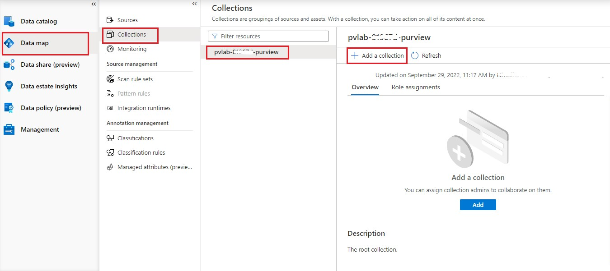

3. Set your Collection's Display Name as ```Contoso```

   

4. In the Collection Admin, search by your name or email address and select.
   ```E.g: xxx@microsoft.com```

5. Click **Create**

6. User can also edit a collection by clicking **Edit** ✏️ option.

   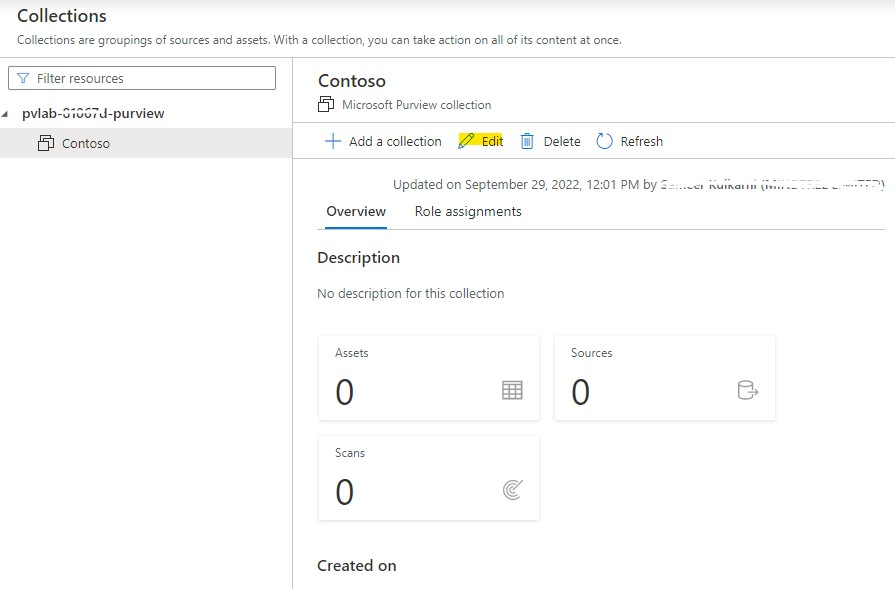

7. Description and collection admin can be changed or added.

   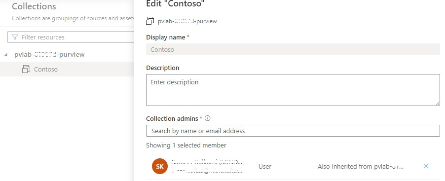


### Grant the Microsoft Purview Managed Identity Access

1. Navigate to your Azure Data Lake Storage Gen2 account (e.g. `pvlab{randomId}adls`) and select **Access Control (IAM)** from the left navigation menu. Click **Add role assignment**.

    
  
2. Filter the list of roles by searching for `Storage Blob Data Reader`, click the row to select the role, and then click **Next**.

    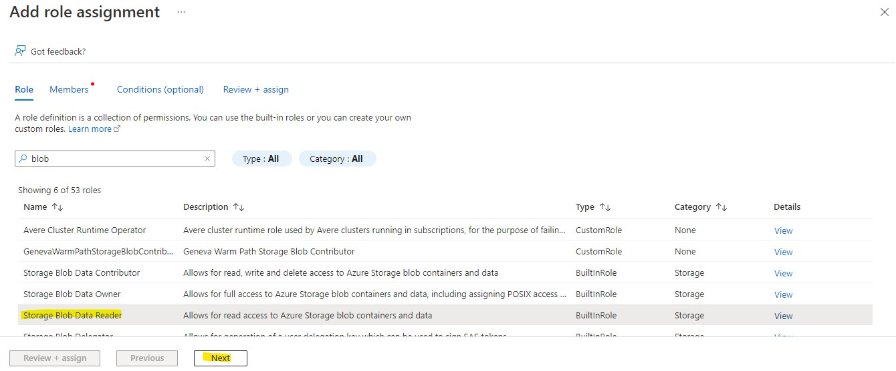

3. Under **Assign access to**, select **Managed identity**, click **+ Select members**, select **Microsoft Purview account** from the **Managed Identity** drop-down menu, select the managed identity for your Microsoft Purview account (e.g. `pvlab-{randomId}-pv`), click **Select**. Finally, click **Review + assign**.

    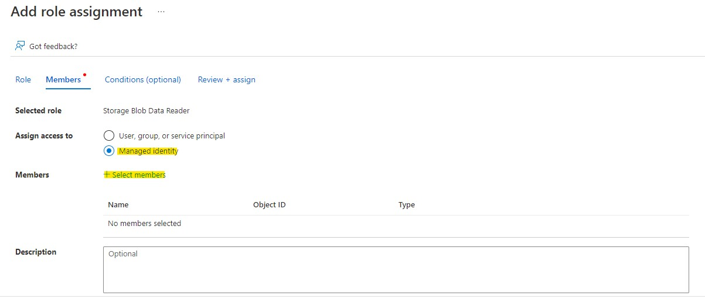
    
    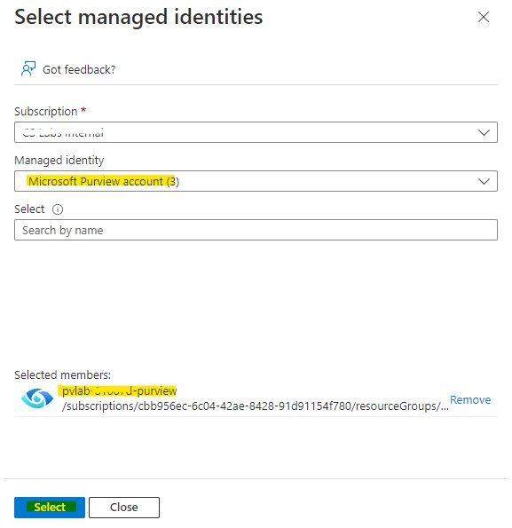

4. Click **Review + assign** once more to perform the role assignment.

    

5. To confirm the role has been assigned, navigate to the **Role assignments** tab and filter the **Scope** to `This resource`. You should be able to see that the Microsoft Purview managed identity has been granted the **Storage Blob Data Reader** role.

    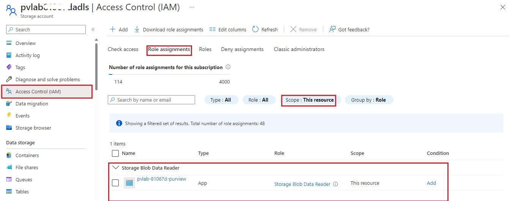
    
### Upload Data to Azure Data Lake Storage Gen2 Account

This Step is already done for you. To confirm the file is present inside ADLS Gen2 Storage account, Navigate to your Azure Data Lake Storage Gen2 account (e.g. `pvlab{randomId}adls`) and select **Containers** from the left navigation menu. Click on **raw** container. Inside you will see a folder with the name **BingCoronavirusQuerySet**.

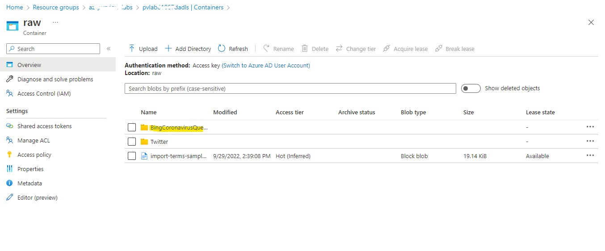
    

### Register a Source (ADLS Gen2)

1. Open the **Microsoft Purview Governance Portal**, navigate to **Data Map** > **Sources** > **Contoso** collection, click on **Register** icon.

    

2. Search for `Data Lake`, select **Azure Data Lake Storage Gen2**, and click **Continue**.

    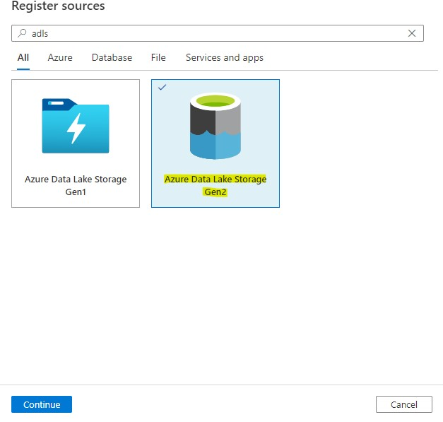

3. Select the **Azure subscription**, **Storage account name**, **Collection**, and click **Register**.

    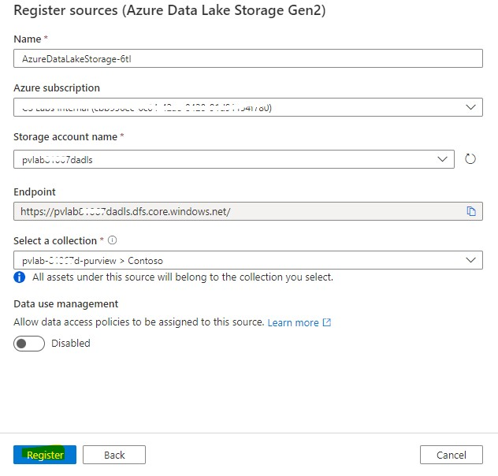


### Scan a Source with the Microsoft Purview Managed Identity

1. Open the **Microsoft Purview Governance Portal**, navigate to **Data Map** > **Sources**, and within the Azure Data Lake Storage Gen2 tile, click the **New Scan** button.

    

2. Click **Test connection** to ensure the Microsoft Purview managed identity has the appropriate level of access to read the Azure Data Lake Storage Gen2 account. If successful, click **Continue**.

    

3. Expand the hierarchy to see which assets will be within the scans scope, and click **Continue**.

    

4. Select the system default scan rule set and click **Continue**.

    

5. Select **Once** and click **Continue**.

    

6. Click **Save and Run**.

    

7. To monitor the progress of the scan run, click **View Details**.

    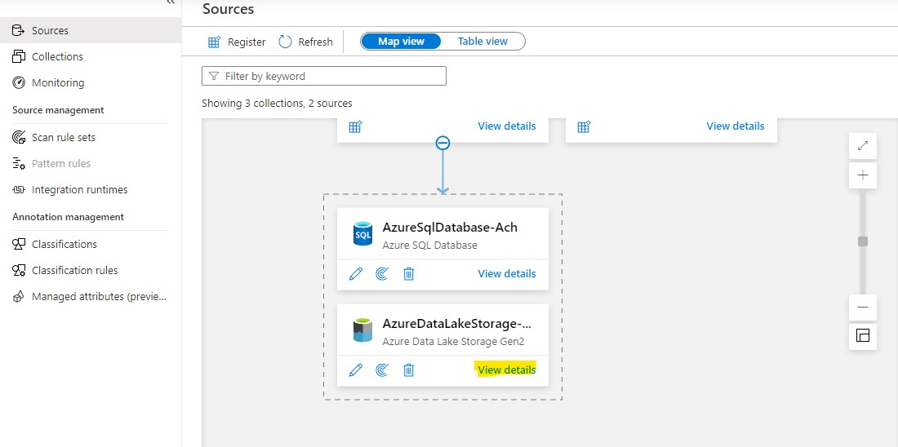

8. Click **Refresh** to periodically update the status of the scan. Note: It will take approximately 5 to 10 minutes to complete.

    
    
    
[Next Module ⏩](../02_maintaining-glossary-by-creating-and-importing-terms/documentation.md)

